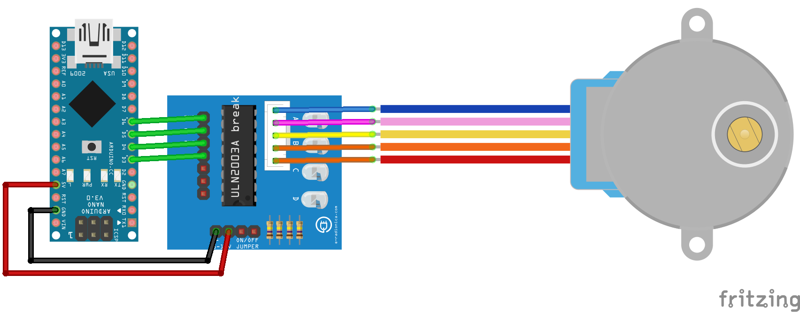
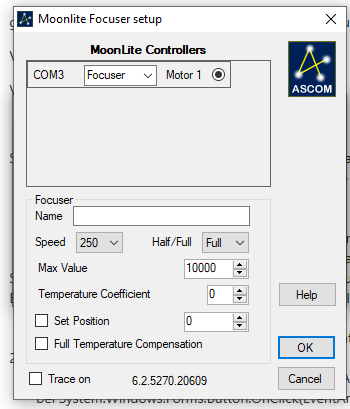

# arduino-motorfocus

Simple moonlite focuser protocol implementation for Arduino and stepper motors.

Tested with Arduino Nano and cheap [28BYJ-48 stepper motor with driver](https://arduino-info.wikispaces.com/SmallSteppers) and [INDI / Ekos](http://indilib.org). Works also with [Pololu A4988 Stepper Motor Driver](https://www.pololu.com/product/1182) (see wiring).

Updated 3D/CAD models for TS 65/420 Quadruplet are available at Thingiverse: <https://www.thingiverse.com/thing:2063325>
Motor focuser for Starlight Feather Touch 2" by Cover1987: <https://www.thingiverse.com/thing:3593910>

## Wiring

### Wiring for 28BYJ-48 stepper motor with ULN2003A breakout board

### Wiring for A4988 driver

Change Line #13 in `arduino-motorfocus.ino` from `//#define USE_DRIVER` to `#define USE_DRIVER`

### Wiring for in/out buttons

The internal pullups are active so you have to connect your buttons to GND.

### Wiring for temperature sensor DS18B20

You need a 4.7kΩ pullup resistor. If there is no sensor attached the temperatur will be zero.

## Troubleshooting

### ASCOM driver cant find the focuser

Some people reported problems with arduino-motorfocus and Windows/ASCOM. If you use the ASCOM-Moonlite.DRO.Focuser driver the focuser doesn't appear in the setup list.

This happens because the setup opens all COM ports, sends a command and waits for a proper response. Unfortunally Windows resets the device when the port is opened (DTR is set to low) and an Arduino clone needs a second or so to boot up so it won't receive the command and the setup gets a timeout. There are multiple ways to solve the problem:

1. You can flash the [MiniCore Bootloader](https://github.com/MCUdude/MiniCore) to your Arduino. This bootloader is faster and in my tests it was fast enough to get detected by the setup

2. Just install a 10nF between RST and GND or remove the 100nF capacitor on the bottom of your Nano. You can see an image of the capacitor and further explanation on [this website](https://www.astroscopic.com/blog/disable-arduinos-auto-reset-connection)

3. Use a different Microcontroller like Arduino Pro Mini with an external USB-TTL converter and dont't connect the DTR line

And voilà the focuser will show up:

### ASCOM driver finds the focuser but can't connect

Same problem as above. Unfortunally the first solution, flashing the bootloader, didn't work for me but the additional capacitor between RST and GND works.

### Other ASCOM errors

If there are different errors, please [open an issue](https://github.com/fehlfarbe/arduino-motorfocus/issues) and attach the logfile. You can activate logging for you focuser in the properties setup:

The logfile is located in `%HOMEPATH%\Documents\ASCOM`

You can also connect an USB-TTL converter to GPIO 10 to see all commands sent by your computer and some debug messages.

## Arduino-motorfocus mounted on TS65/420 Quadruplet

